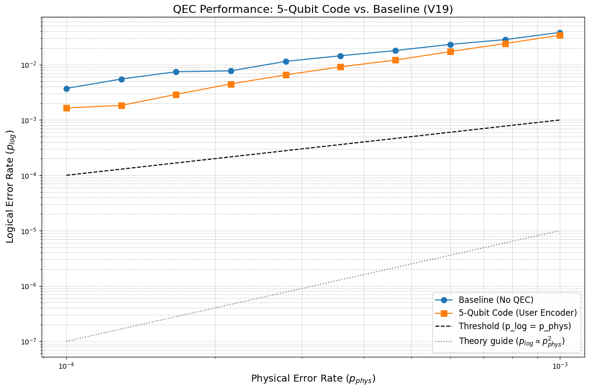

# Physicist
5-Qubit vs. Baseline: A Qiskit Simulation of Quantum Error Correction

This project explores the practical performance of the 5-qubit quantum error correction code (QECC) 1 by simulating it in a noisy environment using Qiskit. It compares the logical error rate of the 5-qubit code against a baseline model (a single, uncorrected qubit) across a range of physical error rates. The goal is to investigate the "gap between theory and practicality" 2 and understand the overhead costs associated with encoding and correcting quantum information.
 
How To Run:
 
Install dependencies from requirements.txt using  
`pip install -r requirements.txt`
 
After installing, run physicist_qecc.py
 

